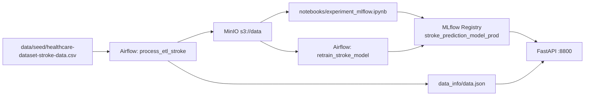

# Arquitectura — Stroke Prediction MLOps

## Diagrama de flujo

## Componentes

| Componente | Rol | Puerto |
|------------|-----|--------|
| **MinIO** | Data lake (S3-compatible) | 9000 / 9001 |
| **PostgreSQL** | Backend Airflow + MLflow | 5432 |
| **Apache Airflow** | Orquestación ETL y retrain | 8080 |
| **MLflow** | Tracking, registry champion/challenger | 5001 |
| **FastAPI** | Serving REST del modelo | 8800 |
| **Valkey/Redis** | Broker Celery para Airflow | — |

## Flujo de datos

1. **Ingesta:** CSV seedeado en repo → montado en Airflow → subido a `s3://data/raw/stroke.csv`
2. **ETL:** Limpieza, feature engineering clínico, one-hot encoding, split 70/30 estratificado
3. **Artefactos:** Train/test en `s3://data/final/` + metadata (`feature_columns`, `optimal_threshold`) en `data.json`
4. **Training:** Notebook ejecuta GridSearchCV LR, calcula umbral Youden, registra pipeline completo en MLflow
5. **Serving:** FastAPI carga champion, transforma input clínico crudo con `inference.py`, aplica umbral
6. **Retrain:** Airflow clona champion, reentrena, compara F1 test, promueve challenger si mejora

## Decisiones de diseño

- **Un solo `src/`:** Misma lógica de preprocessing en ETL (features.py), training (train.py) e inferencia (inference.py)
- **CSV seedeado:** Evita credenciales Kaggle en contenedores
- **Pipeline sklearn completo en MLflow:** Imputación + escalado + LR via `ColumnTransformer` dentro del artefacto
- **Umbral Youden en data.json:** Sincronizado entre notebook y API tras el entrenamiento

## Referencias

- TP AMq1: [ceia-ap-maquina/tp.ipynb](https://github.com/jbmild/ceia-ap-maquina/blob/main/tp.ipynb)
- Base infra: [amq2-service-ml](https://github.com/facundolucianna/amq2-service-ml)
